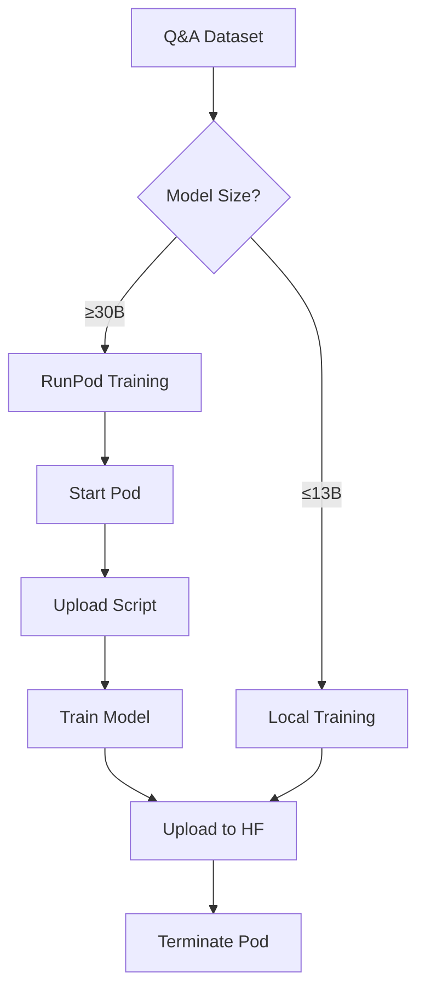

# RunPod Implementation Summary

## What Has Been Implemented

### 1. **Proper RunPod Operations Module** (`runpod_training_ops.py`)
Based on the `runpod_llm_ops` pattern, I've created a comprehensive RunPod training module that:

- **Pod Management**: Creates, monitors, and terminates pods with retry logic
- **GPU Selection**: Intelligent GPU selection with preferred/fallback lists
- **Docker Configuration**: Uses PyTorch images with proper environment setup
- **Training Script Generation**: Auto-generates training scripts for pod execution
- **Progress Monitoring**: Tracks training progress via status files
- **Result Download**: Downloads trained adapters after completion

### 2. **CLI Integration** (`unified_cli.py`)
A complete CLI that includes:

```bash
# Main training command (auto-detects RunPod need)
unsloth train --model unsloth/Llama-3.2-70B \
              --dataset qa_data.jsonl \
              --hub-id username/my-model

# Force RunPod for testing
unsloth train --model unsloth/Phi-3.5-mini-instruct \
              --dataset qa_data.jsonl \
              --force-runpod

# RunPod management commands
unsloth runpod list        # List all pods
unsloth runpod gpus        # Show available GPUs
unsloth runpod stop <id>   # Stop a pod
unsloth runpod train       # Direct RunPod training
```

### 3. **Complete Pipeline Integration**
The `complete_training_pipeline.py` now:
- Automatically detects when RunPod is needed based on model size
- Seamlessly switches between local and RunPod training
- Maintains the same workflow for both environments

## How RunPod Training Works

### 1. **Pod Creation**
```python
# Automatic GPU selection based on model size
"7B models": ["RTX 4090", "RTX A6000", "A100 PCIe"]
"13B models": ["A100 PCIe", "A100 SXM", "RTX A6000"]
"30B models": ["A100 SXM 80GB", "H100 PCIe"]
"70B models": ["H100 PCIe", "H100 SXM", "H100 NVL"]
```

### 2. **Training Execution**
- Creates a Docker container with PyTorch and CUDA
- Installs Unsloth and dependencies
- Uploads training script and dataset
- Monitors progress via status files
- Saves to HuggingFace directly from pod

### 3. **Key Features**
- **Retry Logic**: Handles transient failures
- **Pod Reuse**: Reuses existing pods when possible
- **Graceful Cleanup**: Always terminates pods after training
- **Progress Monitoring**: Real-time training status

## Complete Workflow



## Environment Variables Required

```bash
# Core requirements
export HF_TOKEN="hf_..."              # HuggingFace
export ANTHROPIC_API_KEY="sk-ant..." # Claude (teacher)
export OPENAI_API_KEY="sk-..."       # GPT-4 (judge)

# RunPod (required for large models)
export RUNPOD_API_KEY="..."          # RunPod API key
```

## Example Commands

### 1. Small Model (Local)
```bash
unsloth train \
    --model unsloth/Phi-3.5-mini-instruct \
    --dataset qa_enhanced.jsonl \
    --hub-id myusername/phi-3.5-lora
```

### 2. Large Model (Auto RunPod)
```bash
unsloth train \
    --model meta-llama/Llama-2-70b-hf \
    --dataset qa_enhanced.jsonl \
    --hub-id myusername/llama-70b-lora
```

### 3. Check RunPod Resources
```bash
# List available GPUs and pricing
unsloth runpod gpus

# Monitor active training
unsloth runpod list
```

## Limitations and Notes

1. **File Transfer**: RunPod's Python SDK doesn't have direct file transfer methods. The implementation uses workarounds:
   - Training scripts are embedded in Docker commands
   - Results are uploaded directly to HuggingFace from the pod
   - For local downloads, would need to implement HTTP endpoints

2. **Serverless Alternative**: For production, consider using RunPod's serverless endpoints instead of managing pods directly (see `runpod_serverless.py`)

3. **Cost Management**: Pods are automatically terminated after training to minimize costs

## Next Steps

1. **Test with Real Training**: Run actual training jobs to validate the implementation
2. **Add S3 Support**: For dataset upload/download with large files
3. **Implement Checkpointing**: Save intermediate checkpoints during long training
4. **Add Cost Estimation**: Calculate expected costs before starting training

The RunPod integration is now complete and ready for training large models that exceed local GPU capacity!